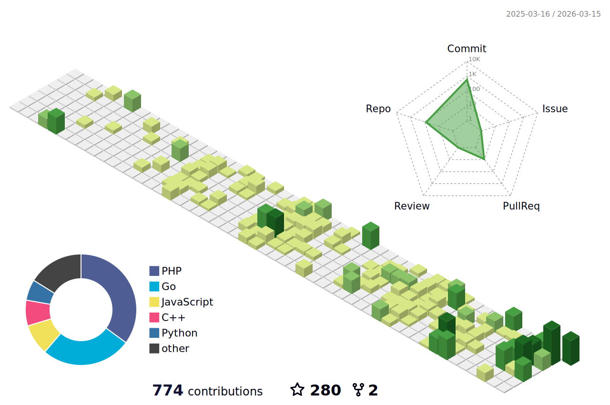
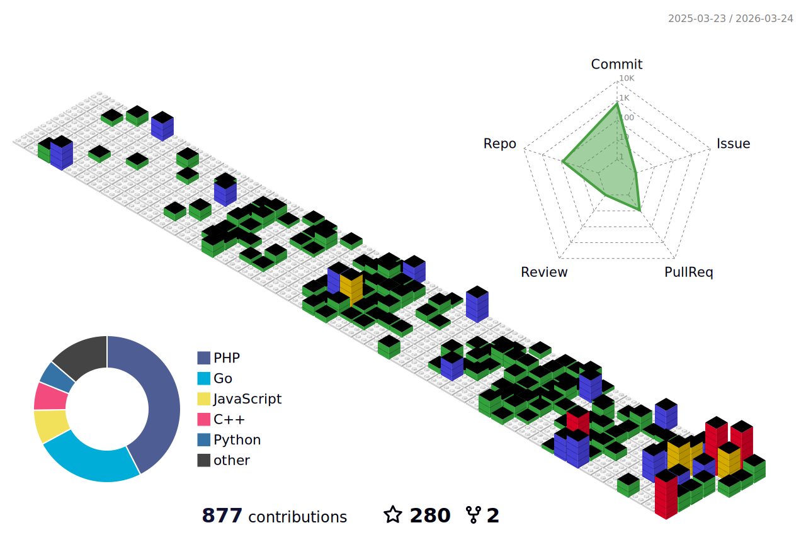

# 💫 About Me:
🔭 I’m currently working on a new Game 🌱 I’m currently learning Machine Learning 💬 Ask me about what you want ⚡ I can play guitar without a guitar

## 🌐 Socials:
   

# 💻 Tech Stack:
                             
# 📊 GitHub Stats:
 
 

### ✍️ Random Dev Quote

### 🔝 Top Contributed Repo

---

  

  

profile-3d-contrib/profile-gitblock.svg

<!-- Proudly created with GPRM ( https://gprm.itsvg.in ) -->
