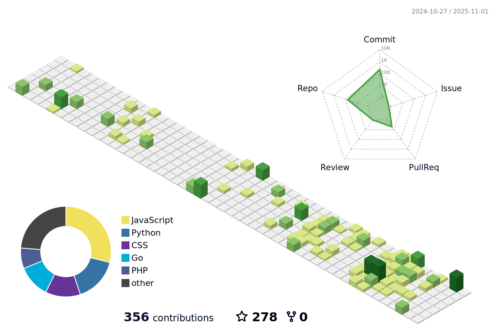

  

  

  

# 💫 About Me:
🔭 I’m currently working on a new Game 🌱 I’m currently learning Machine Learning 💬 Ask me about what you want ⚡ I can play guitar without a guitar

## 🌐 Socials:
   

  

<svg xmlns=\"http://www.w3.org/2000/svg\" viewBox=\"0 0 32 32\"><path d=\"M32 16c0 8.839-7.161 16-16 16s-16-7.161-16-16c0-8.839 7.161-16 16-16s16 7.161 16 16zM22.995 5.917c-1.625 0.056-3.041 0.952-4.099 2.192-1.172 1.36-1.948 2.973-2.511 4.615-1-0.817-1.771-1.885-3.38-2.349-1.292-0.396-2.688-0.135-3.755 0.688-0.548 0.427-0.944 1.011-1.147 1.672-0.479 1.568 0.511 2.968 0.959 3.468l0.984 1.052c0.199 0.204 0.693 0.745 0.448 1.516-0.255 0.844-1.265 1.385-2.307 1.068-0.464-0.141-1.131-0.489-0.98-0.975 0.063-0.203 0.204-0.348 0.281-0.52 0.068-0.147 0.104-0.261 0.125-0.323 0.188-0.62-0.068-1.428-0.735-1.631-0.62-0.193-1.249-0.041-1.5 0.755-0.276 0.907 0.156 2.548 2.48 3.267 2.724 0.833 5.020-0.647 5.348-2.579 0.204-1.208-0.344-2.109-1.344-3.26l-0.817-0.907c-0.495-0.489-0.661-1.333-0.151-1.979 0.432-0.548 1.047-0.776 2.052-0.505 1.473 0.401 2.125 1.416 3.219 2.239-0.453 1.48-0.751 2.964-1.016 4.297l-0.161 0.995c-0.781 4.093-1.375 6.344-2.927 7.636-0.313 0.219-0.76 0.552-1.427 0.577-0.355 0.005-0.475-0.233-0.475-0.343-0.011-0.245 0.199-0.36 0.339-0.469 0.203-0.109 0.521-0.303 0.495-0.901-0.021-0.708-0.609-1.323-1.459-1.296-0.635 0.020-1.604 0.619-1.567 1.713 0.036 1.135 1.093 1.984 2.681 1.927 0.855-0.027 2.751-0.375 4.62-2.599 2.177-2.547 2.787-5.469 3.245-7.609l0.511-2.819c0.285 0.032 0.588 0.053 0.921 0.063 2.708 0.057 4.063-1.348 4.083-2.369 0.016-0.62-0.405-1.229-0.989-1.213-0.515 0.016-0.959 0.369-1.077 0.875-0.125 0.568 0.864 1.084 0.093 1.584-0.547 0.353-1.531 0.604-2.912 0.4l0.251-1.391c0.516-2.635 1.145-5.875 3.547-5.952 0.177-0.011 0.817 0.004 0.828 0.427 0.005 0.14-0.025 0.183-0.192 0.5-0.157 0.208-0.235 0.464-0.224 0.719 0.020 0.672 0.531 1.115 1.276 1.088 0.989-0.031 1.271-1 1.26-1.495-0.041-1.167-1.271-1.896-2.896-1.848z\"/></svg>

<svg xmlns=\"http://www.w3.org/2000/svg\" viewBox=\"0 0 256 95.643\" fill=\"#00acd7\"><path d=\"M19.32 28.96c-.5 0-.623-.25-.374-.623l2.617-3.365c.25-.374.872-.623 1.37-.623H67.43c.5 0 .623.374.374.748l-2.12 3.24c-.25.374-.872.748-1.246.748l-45.12-.125zM.5 40.427c-.5 0-.623-.25-.374-.623l2.617-3.365c.25-.374.872-.623 1.37-.623H60.95c.5 0 .748.374.623.748l-.997 2.99c-.125.5-.623.748-1.122.748L.5 40.427zm30.163 11.467c-.5 0-.623-.374-.374-.748l1.745-3.116c.25-.374.748-.748 1.246-.748h24.928c.5 0 .748.374.748.872l-.25 2.99c0 .5-.5.872-.872.872l-27.172-.125zm129.38-25.178L139.1 32.2c-1.87.5-1.994.623-3.615-1.246-1.87-2.12-3.24-3.5-5.858-4.736-7.852-3.864-15.456-2.742-22.56 1.87-8.476 5.484-12.838 13.586-12.714 23.682.125 9.97 6.98 18.198 16.827 19.57 8.476 1.122 15.58-1.87 21.19-8.226 1.122-1.37 2.12-2.867 3.365-4.612H111.68c-2.617 0-3.24-1.62-2.368-3.74 1.62-3.864 4.612-10.345 6.357-13.586.374-.748 1.246-1.994 3.116-1.994h45.37c-.25 3.365-.25 6.73-.748 10.096-1.37 8.974-4.736 17.2-10.22 24.43-8.974 11.84-20.69 19.195-35.523 21.19-12.215 1.62-23.557-.748-33.53-8.226C74.9 79.69 69.675 70.466 68.304 59c-1.62-13.586 2.368-25.8 10.595-36.52 8.85-11.592 20.566-18.946 34.9-21.563 11.716-2.12 22.934-.748 33.03 6.107 6.606 4.362 11.342 10.345 14.46 17.575.748 1.122.25 1.745-1.246 2.12z\"/><path d=\"M201.297 95.643c-11.342-.25-21.688-3.5-30.413-10.97-7.354-6.357-11.966-14.46-13.46-24.056-2.244-14.085 1.62-26.55 10.096-37.642 9.1-11.966 20.067-18.198 34.9-20.815 12.714-2.244 24.68-.997 35.523 6.357 9.847 6.73 15.954 15.83 17.575 27.795 2.12 16.827-2.742 30.537-14.334 42.254-8.226 8.35-18.322 13.586-29.914 15.954-3.365.623-6.73.748-9.97 1.122zm29.665-50.355c-.125-1.62-.125-2.867-.374-4.113-2.244-12.34-13.586-19.32-25.427-16.577-11.592 2.617-19.07 9.97-21.812 21.688-2.244 9.722 2.493 19.57 11.467 23.557 6.855 2.99 13.71 2.617 20.317-.748 9.847-5.1 15.206-13.087 15.83-23.807z\"/></svg>

# 💻 Tech Stack:
                             
# 📊 GitHub Stats:

### ✍️ Random Dev Quote

### 🔝 Top Contributed Repo

---

<!--

  

-->

  

<picture>
  <source media="(prefers-color-scheme: dark)" srcset="https://raw.githubusercontent.com/MaminrinaEdwino/MaminrinaEdwino/output/github-snake-dark.svg" />
  <source media="(prefers-color-scheme: light)" srcset="https://raw.githubusercontent.com/MaminrinaEdwino/MaminrinaEdwino/output/github-snake.svg" />
  
</picture>

<!-- Proudly created with GPRM ( https://gprm.itsvg.in ) -->
